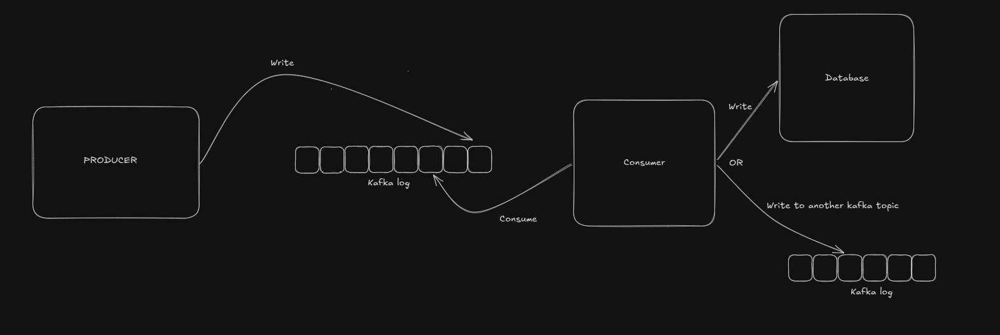
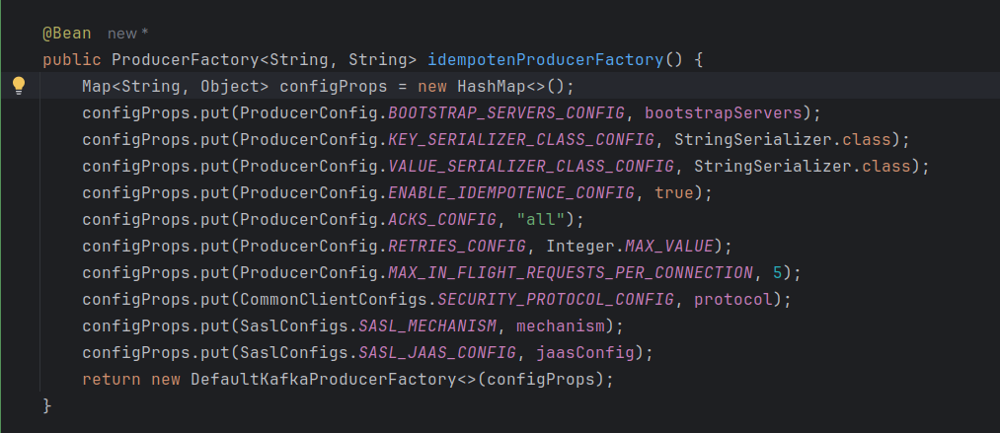
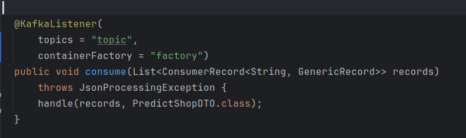

## Introduction

As a backend engineer with more than five years of experience, I've seen Kafka used in many production systems, usually in a setup like this:



Most of the time, it worked without any problems. I never looked closely at the edge cases. Were the code and configuration actually safe, or were we lucky because traffic was low and we had not yet seen a failure?

Today, I want to explain how to build a safe Kafka producer and consumer. By "safe," I mean exactly-once.

Take a look at the picture above. It seems like a simple flow. The producer publishes messages, and the consumer reads them. It then writes the messages—or values derived from them—to a database or sends them to another topic. However, this flow has some edge cases.

### Problem 1 — the producer never learns whether the write landed

The producer app writes to the log but fails to get the acknowledgement back over the network:

```text
Producer                          Kafka broker

   | -------- message M ---------> |
   |                               |
   |                            process M (append M to log)
   |                               |
   |                               |
   | <---------- ACK --------------|
                lost
```
The producer doesn't know whether Kafka stored M. It has two choices:

- If it retries, it might create a duplicate.
- If it doesn't retry, M might be lost.

### Problem 2 — the DB write and the offset commit are two systems

The second problem is harder, and it happens on the consumer side. The consumer reads messages from the log and writes the results to its database. It then fails before committing the offset that marks its position. When the pod restarts or a rebalance assigns the partition to another consumer, the message is processed again. For example:

```text
Kafka offset = 100

1. read offset 100
2. UPDATE database        ✓
3. commit offset 101      ✗ CRASH

restart → offset still 100 → read 100 again → UPDATE database again
```

That last line is a duplicate side effect: the same payment is applied twice, or the same email is sent twice. Unfortunately, reversing the order doesn't solve the problem:

```text
1. read offset 100
2. commit offset 101      ✓
3. UPDATE database        ✗ CRASH

restart → offset is 101 → record 100 is never read again
```

Now you've lost the update instead. Whichever order you pick, there's a window between the two writes where a crash leaves the database and the offset disagreeing.

## Building an exactly-once producer in Kafka

After reading a few articles, I realized that a producer cannot achieve exactly-once semantics by delivering a message exactly once over the network. The reason is the failure described above. Kafka's documentation says the same thing:

> If a producer attempts to publish a message and experiences a network error, it cannot be sure if this error happened before or after the message was committed. This is similar to the semantics of inserting into a database table with an autogenerated key.
>
> — [Kafka design docs, "Message Delivery Semantics"](https://kafka.apache.org/43/design/design/#message-delivery-semantics)

However, we can achieve exactly-once semantics by combining at-least-once delivery with an idempotency check. Kafka supports this approach.

In Kafka, you can configure the producer like this:



Notice four properties.

**`enable.idempotence = true`** — the producer may still send the same message several times, but it gets written to the log only once.

Here is how it works:

- The producer asks the broker for a Producer ID (PID) and adds `(PID, epoch, partition, base sequence number)` to every batch it sends.
- The broker remembers the last **5 batches** it accepted for each PID on each partition.
- If a retry sends a batch that the broker has already written, the broker recognises the sequence number, ACKs the batch again, and does not append it.

That closes the exact failure from Problem 1:

```text
Producer                          Kafka broker

   | -------- M (seq 7) ---------> |
   |                            append M to log
   | <---------- ACK --------------|
                lost
   | -------- M (seq 7) ---------> |   retry
   |                            seq 7 already written → skip append
   | <---------- ACK --------------|
                              log holds exactly one M
```

Keep the scope in mind: this is deduplication **per partition, per producer session**. A new producer session gets a new PID, and the broker does not carry over its record of the old one.

**`acks = "all"`** (`-1` means the same thing) — the leader waits for every in-sync replica before ACKing.

This setting is necessary because idempotence checks for duplicates *against the log*. If only the leader ACKs the record (`acks=1`) and then dies before replication, the record is lost. Sequence numbers cannot bring it back. Idempotence protects against duplicates, while `acks=all` protects against loss. You need both.

**`retries = Integer.MAX_VALUE`** — idempotence is useful only if the producer retries. Without retries, a transient error becomes a silent drop.

The retry period is not infinite. `delivery.timeout.ms` (default 120s) is the actual limit: the producer retries until the timeout expires and then fails the send. Kafka's configuration documentation suggests leaving `retries` unset and controlling retry behaviour through `delivery.timeout.ms` instead. Retries are safe here because the broker does not append duplicate batches.

**`max.in.flight.requests.per.connection = 5`** — how many unacknowledged requests the client will keep on one connection before it blocks.

The important part is how this value affects *ordering*:

- With idempotence **off** and retries on, anything above 1 risks reordering — batch 1 fails and is retried after batch 2 already succeeded.
- With idempotence **on**, ordering is preserved for any allowed value, 1 through 5.

> Additionally, enabling idempotence requires the value of this configuration to be less than or equal to 5, because broker only retains at most 5 batches for each producer. If the value is more than 5, previous batches may be removed on broker side.

### "In-flight request" means a batch, not a message

One detail is worth clarifying: in Kafka, an in-flight request is a ProduceRequest — a batch — not necessarily one message.

```text
Request 1 → [M1, M2, M3]
Request 2 → [M4, M5]
Request 3 → [M6, M7, M8, M9]
```

So `max.in.flight.requests.per.connection=5` means that up to 5 produce requests can await responses on one broker connection. It does not mean "5 messages." The broker also tracks its history in batches.

One last note: all four settings have been the defaults since Kafka 3.0, and that remains true in Kafka 4.3.1.

## Building an exactly-once consumer in Kafka

We've covered only half the story: the producer side. What about the consumer? As described in the introduction, the database write and the Kafka offset commit are separate operations in separate systems. There is no atomic commit across both systems, so there is always a failure window:

1. The listener processes the record and commits the DB transaction.
2. The pod dies before the offset is committed back to Kafka.
3. The restarted (or reassigned) consumer resumes from the last committed offset.
4. It redelivers the record you already saved → duplicate.

The broker-side deduplication configured above does not help here. It removes duplicates *in the log*. This record was written to the log exactly once but delivered twice. If the consumer's work is not idempotent, processing the same record twice can cause serious problems.

There are several ways to ensure exactly-once processing. For example, you can store the offset alongside the business data, as [Jay Kreps describes in his blog](https://medium.com/@jaykreps/exactly-once-support-in-apache-kafka-55e1fdd0a35f). If the output is another Kafka topic rather than a database, use Kafka transactions with `read_committed` consumers. The approach in this section is for database output.

A simple approach is to build an idempotent consumer. Idempotency means that performing an operation multiple times has the same result as performing it once.

To achieve an idempotent consumer, we use a unique message ID for each message. This ID acts as the idempotency key:

```json
{
  "messageId": "ajs-65707fcf61352427e8f1666f0e7f6090",
  "paymentId": "e7bd0e18-57e9-4ef4-928a-4ccc0b189d18",
  "timestamp": "2026-08-25T14:38:23.264Z"
}
```

The ID must be assigned once, when the event is created, and reused for every retry and republish of that event. Generating an ID at send time defeats the purpose. A client that sends the same logical payment again creates a new `messageId`, so the consumer cannot distinguish it from a new payment.

When a record arrives, the consumer checks whether it has processed the `messageId` before. If it has, the consumer skips the record. To track processed IDs, the consumer uses a transaction status log table. The table may contain:

- `id` — primary key of the log record.
- `message_id` — unique message ID, used as the idempotency key. This is the most important field to ensure idempotency.
- `status` — `PROCESSING`/`SUCCEEDED`/`FAILED`, which is useful for diagnostics and replay. The deduplication decision is simply, "Does the row exist?"
- ...

One detail is easy to get wrong: **the `message_id` insert and the business write must happen in the same local database transaction.** Otherwise, you have simply moved Problem 2 down one level. A crash between the two operations leaves a `message_id` for work that never happened, so the retry is skipped:

```text
1. INSERT message_id      ✓
2. UPDATE balance         ✗ CRASH

restart → message_id already present → record skipped → the update is lost forever
```

When committed together, both operations succeed or neither does. Redelivery then becomes a no-op:

```text
Consumer                                Database

   | ---- record (messageId ajs-657) ---> |
   |                        INSERT ajs-657 + UPDATE balance
   |                            one transaction, committed
   | <----------- committed --------------|
   |
  crash before the offset is committed to Kafka
   |
  restart → Kafka redelivers the same record
   |
   | ---- record (messageId ajs-657) ---> |
   |                        ajs-657 already present → skip
   | <------------- no-op ----------------|
                              balance was updated exactly once
```

This is the same technique as storing the offset with the output, and it works for the same reason: there is only one commit to one system. This also defines the boundary of the guarantee. It holds when the side effect is a write to that database. If the side effect is an email or an RPC to another service, the marker and the effect are in separate systems again. You are back to at-least-once processing, although with a narrower failure window.

### Be careful with @KafkaListener

I won't go into detail because this post is already long, but I have one piece of advice about consuming safely from Kafka. Most of us are familiar with code like this:



It looks clean and simple, but this setup can hide important details:

- Error handling and retries: what happens if something goes wrong?
- Manual vs. automatic offset commits: should we control when the message is marked as "done"? The behaviour of `enable.auto.commit = true` differs from Spring Kafka's default `AckMode.BATCH`.
- ...

Be careful when using `@KafkaListener`. I'll cover this topic in more detail in the next post.

## Conclusion

Exactly-once is not one switch that makes the whole system safe. It comes from identifying where a retry can happen and making that retry harmless at each boundary:

- On the producer side, Kafka's idempotent producer combines retries with a PID and sequence numbers so the same batch is not appended twice.
- On the consumer side, when the output is a database, a unique message ID makes redelivery safe — as long as the deduplication record and the business update commit in the same database transaction.
- When both the input and output are in Kafka, Kafka transactions can atomically commit the output records and consumed offsets instead.

The boundary matters. These guarantees do not automatically include an email, an RPC, or a write to another external system. Once one operation spans two systems, there is a failure window again, and the receiving side must also be idempotent or use a design such as an outbox.

So the practical goal is not to prevent every retry. Retries are unavoidable in a distributed system. The goal is to make sure that when a retry happens, it cannot create a second business effect. Producer configuration is one half of that work; consumer transaction boundaries, offset handling, and error handling are the other half. I'll cover those `@KafkaListener` details in the next post.

## References
https://medium.com/@jaykreps/exactly-once-support-in-apache-kafka-55e1fdd0a35f
https://www.confluent.io/blog/exactly-once-semantics-are-possible-heres-how-apache-kafka-does-it/
https://cwiki.apache.org/confluence/spaces/KAFKA/pages/66854913/KIP-98+-+Exactly+Once+Delivery+and+Transactional+Messaging
https://kafka.apache.org/43/design/design/#message-delivery-semantics
