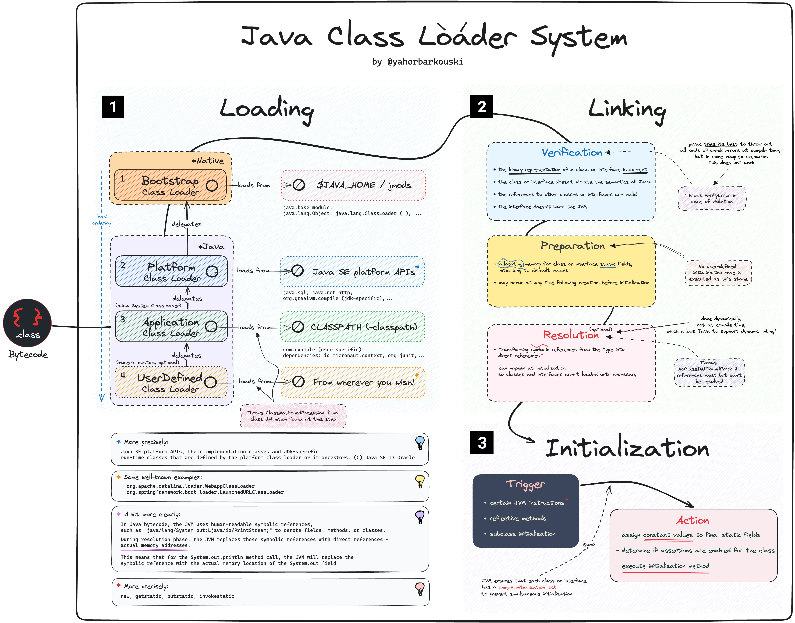

Today we will dive into the "Class loader subsystem", one of the three components of the JVM. I know that theory is terrible, so our topic today will first walk through the idea of the Class Loader and then look at how the Spring Framework gets benefit from this mechanism. (Component scanning, loading @Configuration classes, loading beans, auto-configuration)

## Class Loader subsystem
The class loader subsystem is responsible for finding a class, reading its bytecode, and making it usable by the JVM. The important thing to remember is that classes are **not** all loaded at startup. A class is loaded **lazily** — on first use — and then walks through three phases:

```text
Load → Link (Verify → Prepare → Resolve) → Initialize
```

Let's go through them one by one.

### 1. Load
In the load phase, the JVM:

+ locates the `.class` file (from the classpath, a JAR, or a JDK module),
+ reads its raw bytes,
+ and creates an in-memory `Class<?>` object that represents the type.

But *who* actually goes and finds the bytes? That's the job of a **class loader**, and the JVM ships with three of them arranged in a hierarchy:

```text
        Bootstrap ClassLoader   (parent = null, native code)
              │   loads core java.* / JDK modules (rt.jar in older JDKs)
              ▼
        Platform ClassLoader     (was "Extension" before Java 9)
              │   loads JDK extension / platform modules
              ▼
        Application ClassLoader   (a.k.a. System ClassLoader)
              │   loads your app classes from the classpath
              ▼
        (optional) Custom ClassLoaders
```

#### Parent Delegation Model
These loaders don't work independently. They follow the **Parent Delegation Model**: when a loader is asked to load a class, it doesn't try itself first — it delegates **up** to its parent.

1. The Application loader is asked to load a class.
2. Before doing anything, it asks its parent (Platform) to load it.
3. Platform asks its parent (Bootstrap).
4. Bootstrap tries first. If it can load the class (e.g. `java.lang.String`), done.
5. Only if no parent can find the class does the child loader try to load it itself.

```text
load("com.myapp.Service")

Application ──delegate──▶ Platform ──delegate──▶ Bootstrap
                                                    │ not found
Application ◀──can't──── Platform ◀──can't────── ──┘
     │ found in classpath → loads it
     ▼
```

Why does this matter? **Security and consistency.** Because every load goes up to Bootstrap first, you can never replace a core class. If you write your own `java.lang.String`, the Application loader will still delegate up, Bootstrap will return the *real* `java.lang.String`, and your spoofed version is ignored. Core classes are also loaded exactly once instead of being duplicated across loaders.

> Parent delegation = "always ask your parent first" — it keeps the core JDK classes safe and unique.

### 2. Link
Once a class is loaded, it must be *linked* into the running JVM. Linking has three sub-steps.

**Verify** — The bytecode verifier checks that the `.class` is well-formed and safe: valid constant pool, no illegal jumps, types used correctly, no stack overflows/underflows. This is the JVM enforcing the "Security" benefit we mentioned in Part 1 — untrusted bytecode can't break out and corrupt the runtime.

**Prepare** — Memory is allocated for `static` fields and they are set to their **default** values — `0` for numbers, `false` for booleans, `null` for references. Note: *not* the values you wrote in code yet. That comes later.

**Resolve** — Symbolic references in the constant pool (names like `"java/lang/String"`) are replaced with direct references to the actual loaded types. This step can be done lazily, the first time a reference is actually used.

### 3. Initialize
This is where the class finally "comes alive". The JVM runs the class's static initializers and assigns `static` fields their **real** values — the ones you actually wrote.

This is the key contrast with the **Prepare** step:

```java
public class Config {
    // Prepare:    counter = 0    (default)
    // Initialize: counter = 42   (real value)
    static int counter = 42;

    static {
        System.out.println("Config is being initialized!");
    }
}
```

During Prepare, `counter` is `0`. Only during Initialize does it become `42` and the `static {}` block run.

Initialization is triggered the first time the class is *actively used*, for example:

+ creating an instance (`new Config()`),
+ accessing a static field or method,
+ or loading it reflectively (`Class.forName("Config")`).

> Prepare gives static fields their *default* values; Initialize gives them their *real* values and runs static blocks — and it only happens on first active use.

## How Spring Framework get benefit from Class loader mechanism?
Everything above might feel academic, but it is exactly the foundation Spring is built on. Spring leans heavily on **dynamic class loading + reflection** — the JVM's ability to load and inspect classes at runtime rather than at compile time. Here are four places it shows up.

**1. Component scanning** — When you use `@ComponentScan` (implied by `@SpringBootApplication`), Spring walks the classpath under your base package, reads each class's metadata, and finds the ones annotated with `@Component`, `@Service`, `@Repository`, `@Controller`, etc. It then loads only those candidates and registers them as bean definitions. No class loading + reflection → no scanning.

**2. Loading `@Configuration` classes** — Your `@Configuration` classes are loaded and parsed into bean definitions. Spring also wraps them in a **CGLIB-generated dynamic subclass** (itself a class loaded by a class loader at runtime) so that calling one `@Bean` method from another returns the same singleton instead of a brand-new object.

**3. Bean loading / instantiation** — When the container creates a bean, it starts from the loaded `Class<?>` object and instantiates it **reflectively** — invoking constructors and injecting dependencies it discovered by inspecting the type. The bean you `@Autowired` was never wired by you at compile time; the JVM's reflection did it at runtime.

**4. Auto-configuration** — Spring Boot's "magic" is really a class-loading trick. It reads `META-INF/spring/org.springframework.boot.autoconfigure.AutoConfiguration.imports` (older versions used `spring.factories`) to find candidate configuration classes, then conditionally applies them with annotations like `@ConditionalOnClass`. That condition literally means *"is this class present and loadable on the classpath?"* — if `DataSource` is on the classpath, configure a datasource; if not, skip it. That is class loading being used as a feature toggle.

> Component scanning, `@Configuration`, bean creation, and auto-configuration are all the same idea wearing different hats: load classes at runtime, inspect them with reflection, decide what to do.

