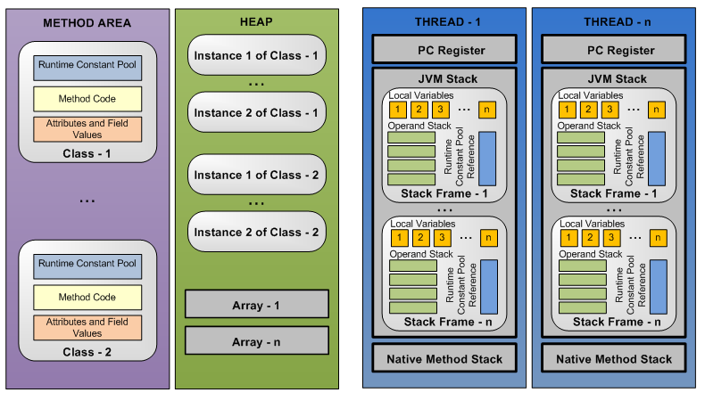
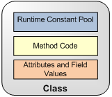
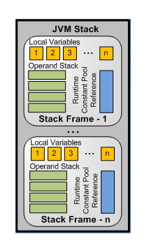

In the [previous blog](/posts/class-loader-subsystem-in-jvm/), we explored how the class loader subsystem works in the JVM, but that's only half the story: classes are loaded, but we don't know where they live.

This is where the JVM's Runtime Data Areas come into play. Understanding run-time data areas is critical to better Java programming. One of the most dreaded errors in Java is `OutOfMemoryError`, and it is related to JVM memory areas. We should have a better understanding of JVM internals — how its data areas work — so that we have a better grip over these kinds of JVM errors. In this article, we will learn about the types of run-time memory areas in the JVM and how they work.

Runtime Data Areas are the parts of memory the JVM uses to run your program. Some of these areas are shared by the whole program (shared with all threads) and last as long as the JVM is running (like the heap, where objects live). Others are created for each thread and disappear when that thread finishes (like the stack, which tracks method calls).

Everything below is grounded in the *Java Virtual Machine Specification, Java SE 21 Edition* — I'll cite it as **JVMS** from here on (e.g. `JVMS §2.5.4` means "section 2.5.4 of that spec").

## I. Common Memory Areas (shared with all threads)
### Method area
Once a class's bytecode is loaded by a JVM class loader, it’s passed to the JVM for further processing. The JVM creates an internal representation of the class and stores it in the method area. This internal representation is exactly the *structured, in-memory representation* the [Loading step in Part 2](/posts/class-loader-subsystem-in-jvm/) set out to build — Part 2 covered *who* finds the bytes; the method area is *where* the result ends up living (JVMS §2.5.4). The following data areas are contained within the internal representation of a class:

- **Runtime Constant Pool** contains constants used in a particular class. The constants can be of types int, float, double, and UTF-8. It also contains references to methods and fields. These method and field references start life as **symbolic references** (names like `"java/lang/String"`) and get swapped for direct references during the **Resolution** sub-step of linking we saw in [Part 2](/posts/class-loader-subsystem-in-jvm/). The pool itself is constructed when the class is created (JVMS §2.5.5, §5.1).

- **Method Code** is the implementation (opcodes) of all class methods.

- **Attribute and Field Values** contain all named attributes and field values of a class. A field value points to a value stored in the runtime constant pool.

> **Where do the linking & initialization steps from Part 2 land?** The method area is the physical home for most of that work: **Loading** builds the internal class representation here, **Resolution** rewrites this class's runtime constant pool, and **Preparation** allocates the class's `static` fields here with their *default* values before **Initialization** overwrites them with their *real* ones. (Spec-wise those `static` fields are method-area *class data*; HotSpot since Java 8 actually keeps their values in the class's `java.lang.Class` mirror on the **heap** — a good reminder that the spec defines *what* exists and leaves *where* to the implementation.)

### Heap
- The heap data area is created at VM startup and is used to store objects of classes and arrays.
- The size of a heap can be fixed or dynamic.
- A heap must provide a garbage collection mechanism to reclaim unused space; this is where the garbage collector comes into the picture. Claiming the memory back is done automatically by the garbage collector (GC). This is one of the best features of Java. If the allocated memory is not sufficient at run-time, the JVM can throw `OutOfMemoryError`.

Everything above is what the **JVMS** guarantees about the heap — deliberately abstract. How the heap is *physically organized* (generational layout, PermGen → Metaspace, GC algorithms like G1/ZGC) is a **HotSpot implementation detail the spec doesn't mandate**, and it's a deep-dive in its own right. We'll cover it next in [Heap Structure & Garbage Collection](/posts/heap-structure-and-garbage-collection/).

> **Connecting back to Part 2:** every trigger that *actively uses* a class — `new Config()`, reflective instantiation, the Spring beans and CGLIB proxies from the [last post](/posts/class-loader-subsystem-in-jvm/) — produces an **object**, and every one of those objects is allocated here on the heap. The division of labour is clean: class *metadata* goes to the **method area**, class *instances* go to the **heap**.

## II. Exclusive Memory Areas (managed per-thread)
### JVM Stack
- Every thread has a private JVM stack.
- A stack is created at thread startup, and its size can be static or dynamic.
- A JVM stack is used for storing stack frames; a new stack frame is created and pushed onto a thread's stack every time a method is invoked.
- A frame is popped when a method returns. Though there may be multiple frames on a stack from nested method calls, only one frame is active at a given time for a thread.

A JVM throws a `StackOverflowError` when a thread needs a stack area larger than is permitted or than the available memory. If a JVM stack is dynamically allocated, a JVM may throw an `OutOfMemoryError` if insufficient memory is available to meet a stack size increase request. It may also throw an `OutOfMemoryError` if insufficient memory is available during initial stack allocation.

### Stack Frame
A new stack frame is allocated and pushed into a JVM stack every time a method is invoked. A frame is popped from the stack and destroyed upon the completion of method invocation irrespective of whether the completion is normal or abrupt (uncaught exception). Each frame has its own operand stack, an array of local variables, and a reference to the runtime constant pool.

- **Local Variables**: A JVM uses local variables to pass around method parameters. Each frame contains an array of local variables. The size of the table is determined at class compile time. It can store values of type boolean, byte, char, short, int, float, reference, or return address. A long or a double value occupies two consecutive local variables.
For all instance methods, including constructors, the local variable at index 0 always refers to the `this` object. Subsequent indexes, starting at position 1, store the method parameters.

- **Operand Stack**: the operand stack records the pushing and popping of values by bytecode instructions during the execution of a method. The size of the operand stack is determined at compile time. The operand stack is empty at the beginning of a method's execution. During the execution of the method, various bytecode instructions push values onto and pop values from the operand stack.

- **Reference to Runtime Constant Pool**: Note the word *reference* — the frame does **not** hold its own pool. There is only **one** runtime constant pool per class, and it lives in the **method area** (Section I). Each frame just carries a **pointer** to the pool of *its* class, because bytecode refers to things by constant-pool index rather than by name. When a frame executes `getstatic #8`, the `#8` is an index — the frame follows its pointer to the method-area pool to find out what entry `#8` actually is. That lookup is also where the **Resolution** sub-step from [Part 2](/posts/class-loader-subsystem-in-jvm/) pays off: the *first* time `#8` is touched it may still be a **symbolic** reference (a name like `"Config.counter"`), so the JVM resolves it into a direct reference *in that one method-area pool* — and every later frame sharing the class sees the already-resolved entry. The frame reaches the pool; the pool never points back into a frame.

> **Connecting back to Part 2:** this per-thread execution machinery is where the JVM's *laziness* finally pays off. Loading, Resolution, and Initialization were all described as happening on *first active use* — and "active use" concretely means *a frame executing a bytecode*. When some frame runs `new Config()`, calls a static method, or reads a `static` field, that instruction is the trigger that pulls the class through the **load → link → initialize** pipeline (and runs its `static {}` block) exactly when it's needed — never before.

### PC Register
In general computer architecture terms, the program counter (PC) register keeps track of the instruction executing at any moment. It is like a pointer to the current instruction in the sequence of instructions in a program. Due to thread switching, the CPU needs to remember the location of the next instruction of the original thread, so each thread needs to have its own PC. The same holds in JVM terms. Because Java supports multithreading, a PC register is created every time a new thread is created. The PC keeps a pointer to the current instruction being executed in its thread. If the currently executing method is `native`, then the value of the PC register is undefined.

### Native Method Stack
Native method stacks are similar to JVM stacks, except that JVM stacks serve Java methods while native method stacks serve native methods. In the HotSpot virtual machine implementation, the native method stack and the JVM stack are combined. As with the JVM stack, a `StackOverflowError` or an `OutOfMemoryError` can be thrown.

## III. The difference between the stack and the heap
So we know what the stack and heap are in sections above, but what exactly is the difference between the Stack and the Heap, why does the JVM need both instead of just collapsing them into one place?

### Lifetime : LIFO vs "live as long as something points at it"

Because in the stack, stack frames follow a strict **Last-In, First-Out—LIFO—discipline**, so all data in the stack is tied directly to method invocation, they come alive when a method is invoked, and are removed when that invocation completes. No garbage collector is needed to search for individual local variables.

But we also have data which can live outside of a method - you can return it from a method, assign it to a field, hand it to another thread or a static object (you declare a static **Map** or **List** in a constants file). This is where the heap comes in. Its lifetime is governed not by who created it but by who still references it. That's exactly why the heap "must provide a garbage collection mechanism" and the stack does not. There is no simple LIFO rule that tells the JVM exactly when an object is no longer needed, the heap needs a Garbage Collector that starts from a set of roots (the live stack frames, static fields, etc.) and marks every object it can reach by following references. Anything it can't reach — even if other dead objects still point at it — is garbage.

The deeper idea is this:

> If a piece of execution state has a lifetime strictly tied to a scope or call structure, it can often be reclaimed through simple structural rules.

> If data can outlive the scope that created it, the runtime needs another ownership or lifetime-management mechanism.

That idea appears again and again across languages and runtimes.